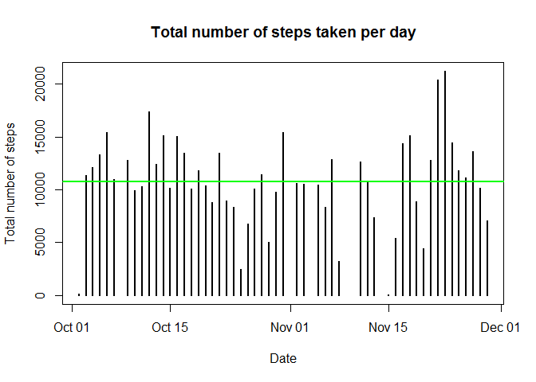
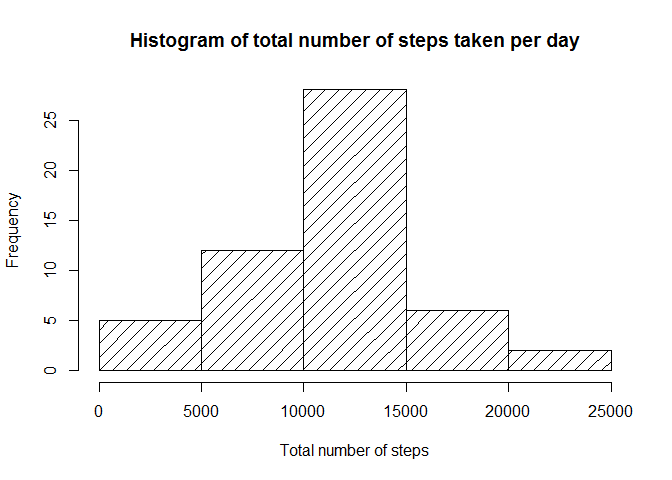
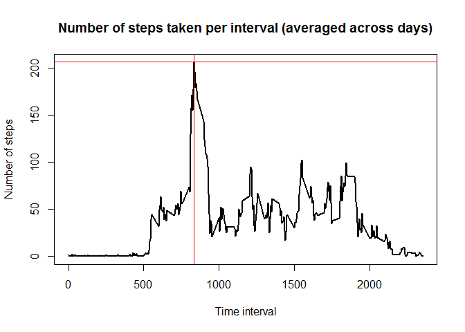
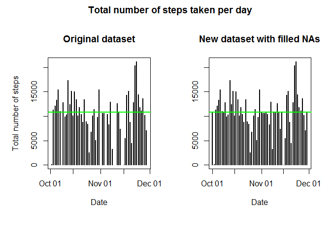
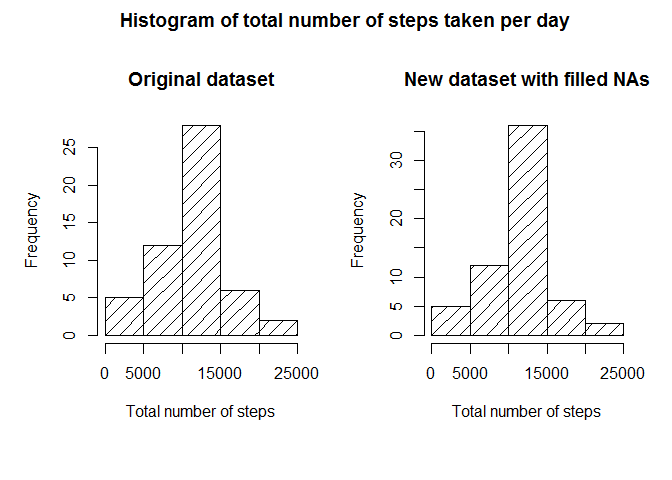
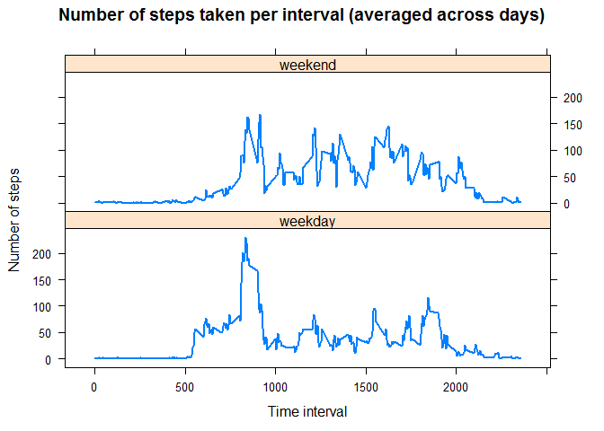

# Reproducible Research: Peer Assessment 1
Luis Sandino  

***


Created on 2016-02-04 13:36:39 using R version 3.2.3 (2015-12-10)

***

## Loading and preprocessing the data

Read CSV file

```r
activity <- read.csv("activity.csv")
```

Print some data and examine data structure

```r
head(activity)
```

```
##   steps       date interval
## 1    NA 2012-10-01        0
## 2    NA 2012-10-01        5
## 3    NA 2012-10-01       10
## 4    NA 2012-10-01       15
## 5    NA 2012-10-01       20
## 6    NA 2012-10-01       25
```

```r
str(activity)
```

```
## 'data.frame':	17568 obs. of  3 variables:
##  $ steps   : int  NA NA NA NA NA NA NA NA NA NA ...
##  $ date    : Factor w/ 61 levels "2012-10-01","2012-10-02",..: 1 1 1 1 1 1 1 1 1 1 ...
##  $ interval: int  0 5 10 15 20 25 30 35 40 45 ...
```

```r
summary(activity)
```

```
##      steps              date          interval   
##  Min.   :  0    2012-10-01:  288   Min.   :   0  
##  1st Qu.:  0    2012-10-02:  288   1st Qu.: 589  
##  Median :  0    2012-10-03:  288   Median :1178  
##  Mean   : 37    2012-10-04:  288   Mean   :1178  
##  3rd Qu.: 12    2012-10-05:  288   3rd Qu.:1766  
##  Max.   :806    2012-10-06:  288   Max.   :2355  
##  NA's   :2304   (Other)   :15840
```

Change date column type from factor to Date

```r
activity$date <- as.Date(activity$date)
```

Subset data to remove NAs

```r
activity.sub <- subset(activity,!is.na(activity$steps))
```

## What is mean total number of steps taken per day?

Organize data subset by date

```r
activity.sub <- group_by(activity.sub,date)
```

Calculate the total number of steps taken per day

```r
steps.per.day <- summarize(activity.sub,total=sum(steps))
print(steps.per.day)
```

```
## Source: local data frame [53 x 2]
## 
##          date total
##        (date) (int)
## 1  2012-10-02   126
## 2  2012-10-03 11352
## 3  2012-10-04 12116
## 4  2012-10-05 13294
## 5  2012-10-06 15420
## 6  2012-10-07 11015
## 7  2012-10-09 12811
## 8  2012-10-10  9900
## 9  2012-10-11 10304
## 10 2012-10-12 17382
## ..        ...   ...
```

Plot the total number of steps taken per day

```r
plot(steps.per.day$total ~ steps.per.day$date,type="h",lwd=2,
     main="Total number of steps taken per day",
     xlab="Date",ylab="Total number of steps")
abline(h=mean(steps.per.day$total),lwd=2,col="green")
```



Plot the histogram of total number of steps taken per day

```r
hist(steps.per.day$total,density=10,
     main="Histogram of total number of steps taken per day",
     xlab="Total number of steps")
```



Calculate and report the mean and median of the total number of steps taken per day

```r
steps.mean <- mean(steps.per.day$total)
steps.median <- median(steps.per.day$total)
```

Mean: __10766.19__

Median: __10765__

## What is the average daily activity pattern?

Organize data by time interval

```r
activity <- group_by(activity,interval)
```

Calculate the number of steps taken per interval, averaged across all days

```r
steps.per.interval <- summarize(activity,avg=mean(steps,na.rm=TRUE))
```

Look for the 5-minute interval, on average across all the days, which contains the maximum number of steps

```r
int.max.idx <- which.max(steps.per.interval$avg)
int.max <- steps.per.interval$interval[int.max.idx]
steps.max <- steps.per.interval$avg[int.max.idx]
```

Plot the number of steps taken per interval, averaged across all days

```r
plot(steps.per.interval$avg ~
     steps.per.interval$interval,type="l",lwd=2,
     main="Number of steps taken per interval (averaged across days)",
     xlab="Time interval",ylab="Number of steps")
abline(v=int.max,h=steps.max,lwd=1,col="red")
```



The 5-minute interval __835__ contains the maximum number of steps averaged across days (__206.17__)

## Imputing missing values

Calculate and report the total number of missing values in the dataset

```r
total.NAs <- sum(is.na(activity$steps))
per.NAs <- mean(is.na(activity$steps))
print(total.NAs)
```

```
## [1] 2304
```

```r
print(per.NAs)
```

```
## [1] 0.13
```

As can be seen, there are __2304__ NAs in the dataset which represent the __13.11%__ of the data  

Create a new dataset filling in all of the missing values in the original dataset using the _interval avegarge across days_

```r
idx <- is.na(activity$steps)
activity.new <- activity
activity.new[idx,"steps"] <- steps.per.interval$avg[match(activity$interval[idx],steps.per.interval$interval)]
```

Organize new data by date

```r
activity.new <- group_by(activity.new,date)
```

Calculate the total number of steps taken per day

```r
steps.per.day.new <- summarize(activity.new,total=sum(steps))
print(steps.per.day.new)
```

```
## Source: local data frame [61 x 2]
## 
##          date total
##        (date) (dbl)
## 1  2012-10-01 10766
## 2  2012-10-02   126
## 3  2012-10-03 11352
## 4  2012-10-04 12116
## 5  2012-10-05 13294
## 6  2012-10-06 15420
## 7  2012-10-07 11015
## 8  2012-10-08 10766
## 9  2012-10-09 12811
## 10 2012-10-10  9900
## ..        ...   ...
```

Plot the total number of steps taken per day

```r
par(mfrow=c(1,2),oma=c(2,1,2,0))
plot(steps.per.day$total ~ steps.per.day$date,type="h",lwd=2,
     main="Original dataset",
     xlab="Date",ylab="Total number of steps")
abline(h=mean(steps.per.day$total),lwd=2,col="green")
plot(steps.per.day.new$total ~ steps.per.day.new$date,type="h",lwd=2,
     main="New dataset with filled NAs",
     xlab="Date",ylab="")
abline(h=mean(steps.per.day.new$total),lwd=2,col="green")
title("Total number of steps taken per day", outer=TRUE)
```



As can be seen, the gaps in the original data are filled but there is no change in the mean

Plot the histogram of total number of steps taken per day

```r
par(mfrow=c(1,2),oma=c(2,1,2,0))
hist(steps.per.day$total,density=10,
     main="Original dataset",
     xlab="Total number of steps")
hist(steps.per.day.new$total,density=10,
     main="New dataset with filled NAs",
     xlab="Total number of steps")
title("Histogram of total number of steps taken per day", outer=TRUE)
```



As can be seen, the y-axis values change a little, but the distribution of the data is quite similar

Calculate and report the mean and median of the total number of steps taken per day

```r
steps.mean.new <- mean(steps.per.day.new$total)
steps.median.new <- median(steps.per.day.new$total)
```

New mean: __10766.19__

New median: __10766.19__

As mentioned before, the mean doesn't change. The median changes and becomes equal to the mean in this case.

## Are there differences in activity patterns between weekdays and weekends?

Create a new factor variable in the dataset with two levels ("weekday" and "weekend") indicating whether a given date is a weekday or weekend day

```r
period <- factor(as.numeric(wday(activity.new$date)==1|wday(activity.new$date)==7),
                 c(0,1),c("weekday","weekend"))
activity.new <- cbind(activity.new,period)
```

Organize data by time period and time interval

```r
activity.new <- group_by(activity.new,period,interval)
```

Calculate the number of steps taken per period and per interval, averaged across all days

```r
steps.per.interval.new <- summarize(activity.new,avg=mean(steps))
```

Plot for the two periods, the number of steps taken per interval, averaged across all days

```r
xyplot(steps.per.interval.new$avg ~
     steps.per.interval.new$interval|steps.per.interval.new$period,
     type="l",lwd=2,layout=c(1,2),
     main="Number of steps taken per interval (averaged across days)",
     xlab="Time interval",ylab="Number of steps")
```



***
